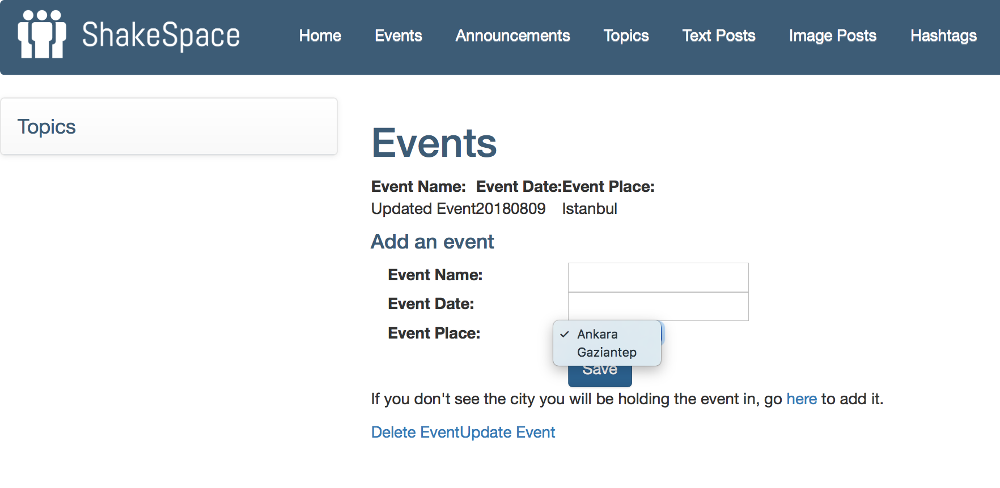
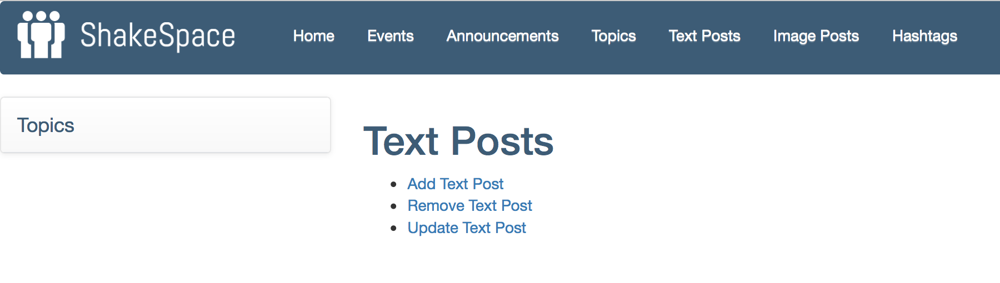
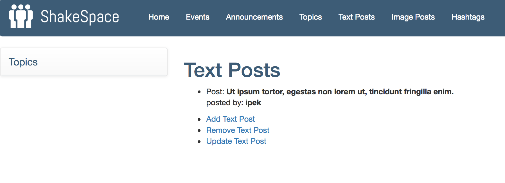

Parts Implemented by İpek Karakurt
================================
Events
########
Adding an Event
***********

If there is an event coming up that you wish to advertise on ShakeSpace, it is possible to add that event on the website by filling in its name, date and the place that the event is going to take place in. If the place of the newly added event is not present as an option to select on the dropdown list, it is possible to add that place yourself. How to do so will be explained in this document.

After clicking on the Save button, the added event is displayed on the page.

Deleting an Event
***********

If an event that was added to the website is cancelled and the user wishes to delete the event entry on the website, it is possible to do so by going to the Delete Event page by clicking on the link on Events page, and then entering the name of the event and clicking on the Delete button.

After the deletion, it can be seen that the event entry is removed from the list on the events page.

.. image:: ./ipek_ss/deletedevent.png

Updating an Event
***********

If the name, date or the place of an event changes and the user wishes to update the event entry on the website, it is possible to do so by going to the Update Event page by clicking on the link on Events page, and then entering the event's old name as well as the new information about the event, and then clicking on the Update button.

After the update operation, it can be seen that the event entry is updated on the list on the events page.

Place
########
In the case that the place that an event is going to place in not being in the list of already added places, it is possible to add a new place. The newly added place will be displayed on the dropdown list of events on the event adding page. It is possible to go to the event adding page by clicking on the link provided on events page.

Adding a Place
***********
A list of already added places is displayed on top of the page. The user needs to type in the name of the place to be added.

After typing in the place to be added and clicking on the Save button, the added place is displayed on the places page.

It is also displayed now as an option on the events page.

Deleting a Place
***********

If the user wishes to delete the place entry on the website, it is possible to do so by going to the Delete Place page by clicking on the link provided on Places page, and then entering the name of the place and clicking on the Delete button.

After the deletion, it can be seen that the event entry is removed from the list on the places page.

The place is also removed from the events page as an option on the dropdown list of places.

Updating a Place
***********

If the name of a place changes and the user wishes to update the place entry on the website, it is possible to do so by going to the Update Place page by clicking on the link on Places page, and then entering the place's old name as well its new name, and then clicking on the Update button.

After the update operation, it can be seen that the event place is updated on the list on the places page.

The place is also updated on the events page as an option on the dropdown list of places.

Text Posts
########
Adding a Text Post
***********
A list of text posts added by the user is displayed on top of the page. 

After typing in the text post to be added and clicking on the Save button, the added text post is displayed on the page.

Deleting a Text Post
***********

If the user wishes to delete the text post they have previously written on the website, it is possible to do so by going to the Remove Text Post page by clicking on the link provided on Text Posts page, and then the text post content and clicking on the Delete button.

.. image:: ./ipek_ss/deletingtextpost.png

After the deletion, it can be seen that the text post entry is removed from the list on the text posts page.

Updating a Text Post
***********

If the the user wishes to update the text post they posted previously on the website, it is possible to do so by going to the Update Text Post page by clicking on the link on Text Posts page, and then entering the text post's old content as well its new content, and then clicking on the Update button.

After the update operation, it can be seen that the text post is updated on the list on the text posts page.

